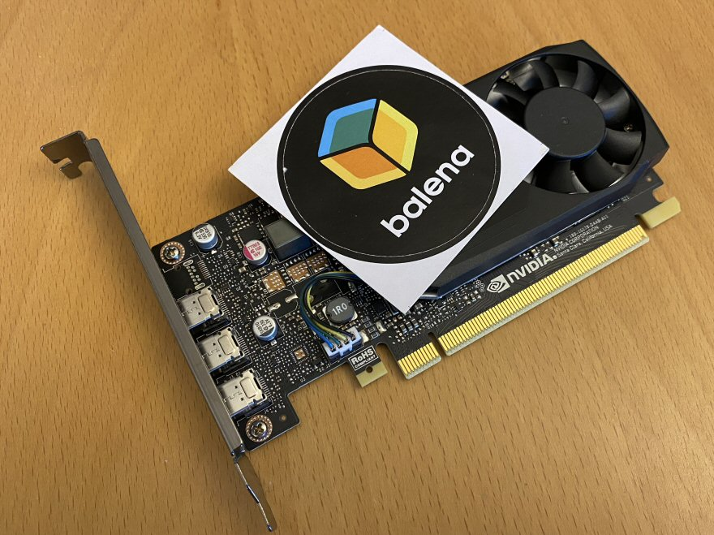

# nvidia-x86 on balena
Example of using an Nvidia GPU in an x86 device on the balena platform.

This project shows you how to build the required kernel modules drivers for your GPU, and optionally load firmware onto the device.

See the accompanying [blog post](https://www.balena.io/blog/how-to-use-nvidia-gpu-on-x86-device-balenaOS/) for more details!



Note that although these examples should work as-is, the resulting images are quite large and should be optimized for your particular use case. One possibility is to utilize [multistage builds](https://www.balena.io/docs/learn/deploy/build-optimization/#multi-stage-builds) to reduce the size of your containers. Below is a summary of the containers in this project, with all of the details following in the next section.

| Service | Image Size | Description |
| ------------ | ----------- | ----------- |
| gpu | 4.18 GB | main example - downloads, builds and installs gpu kernel modules (required)|
| cuda | 19.63 GB | example container with CUDA toolkit installed (optional)|
| app | 7.88 GB | example of app container installing PyTorch (optional) |
| nv-pytorch | 20.37 GB | example of using an Nvidia base image for PyTorch  (optional)|

## How it works
### gpu container
This is the main container in this example and the only one you need to obtain GPU access from within your container or for any other containers in the application. It downloads the kernel source files for our exact OS version and uses them, along with the driver file downloaded from Nvidia to build the required Nvidia kernel modules. Finally, the `entry.sh` file unloads the current Nouveau driver if it's running and loads the Nvidia modules. You can also optionally load firmware onto the GPU from this script if your device requires it.

This container also provides CUDA compiled application support, though not development support - see the CUDA container example for development use. You could use this image as a base image, build on top of the current example, or use alongside other containers to provide them with gpu access.

Before using this example, you'll need to make sure that you've set the variables at the top of the Dockerfile:
- `VERSION` is the version of balenaOS being used on your device. This needs to be URL-encoded, so a plus sign (+) if present needs to be written as `%2B`.
- `BALENA_MACHINE_NAME` is the device type of your balenaOS from [this list](https://www.balena.io/docs/reference/hardware/devices/)
- `YOCTO_VERSION` is the version of Yocto Linux used to build your version of balenaOS. You can find it by logging into your host OS and typing: `uname -r`
- `NVIDIA_DRIVER_VERSION` is the version of the Nvidia driver you want to download and build using the list found [here]( https://www.nvidia.com/en-us/drivers/unix/) Usually, you can use the "Latest Production Branch Version". Be sure to use the exact same driver version in any other containers that need access to the GPU. 

**Important notes:**

- Reboot after making any changes or driver version updates. You may receive "version mismatch" errors until you reboot.
- If you are trying to use this example with balenaOS < 3.0 change any occurences of `kernel_modules_headers` (such as in line 30 of the gpu Dockerfile) to `kernel-source`.
- There are two types of drivers available for NVIDIA GPUs: A proprietary one and an open source one. Per NVIDIA, "new GPUs are likely to be better supported by the open driver, while the proprietary driver is better for older cards." This example uses the propretary driver - see the comments in the Dockerfiles to change to the open driver. (Some small edits are required.) Check dmesg for errors that may help you decide which one to use, for example: `NVRM: installed in this system requires use of the NVIDIA open kernel modules.`
- The `entry.sh` file adds a firmware path to the kernel and copies firmware into that location in case your card needs to load it. Make sure to update the folder name in the source file path to match the NVIDIA driver version used in your Dockerfile.

If this container is set up and running properly, you should see the output below (for your gpu model) in the terminal:
```
+-----------------------------------------------------------------------------------------+
| NVIDIA-SMI 580.119.02             Driver Version: 580.119.02     CUDA Version: 13.0     |
+-----------------------------------------+------------------------+----------------------+
| GPU  Name                 Persistence-M | Bus-Id          Disp.A | Volatile Uncorr. ECC |
| Fan  Temp   Perf          Pwr:Usage/Cap |           Memory-Usage | GPU-Util  Compute M. |
|                                         |                        |               MIG M. |
|=========================================+========================+======================|
|   0  NVIDIA GeForce RTX 2060 ...    Off |   00000000:01:00.0 Off |                  N/A |
| 21%   36C    P0              1W /  175W |       0MiB /   8192MiB |      0%      Default |
|                                         |                        |                  N/A |
+-----------------------------------------+------------------------+----------------------+

+-----------------------------------------------------------------------------------------+
| Processes:                                                                              |
|  GPU   GI   CI              PID   Type   Process name                        GPU Memory |
|        ID   ID                                                               Usage      |
|=========================================================================================|
|  No running processes found                                                             |
+-----------------------------------------------------------------------------------------+
```
### cuda container
The CUDA container example demonstrates how to install and use the CUDA toolkit (for CUDA development, etc...) in a separate container from the gpu container. The gpu container must be running first for this container to work properly. You'll need to supply a few variables for the Dockerfile, and they must match the values used in the accomanying gpu container as described above. 
The variables are: `VERSION`, `BALENA_MACHINE_NAME`, `YOCTO_VERSION` and `NVIDIA_DRIVER_VERSION`

This is one example of separating the GPU kernel module loading from an application container. Note that all containers needing GPU access must load Nvidia drivers that exactly match the version used in the gpu container. In this case, the same driver from the same Nvidia source as the gpu container is used. (In the app container example below, the distribution's Nvidia drivers are used instead.) The CUDA runtime in our example gpu container (based on the selected driver version) is 13.0, so that's the version of CUDA we install in this container. (There is no release for CUDA 13.0 for Debian 13, so this container uses a Debian 12 base image instead)

If this container is running properly, you should see something similar to the following output in the logs:
```
CUDA Device Query (Runtime API) version (CUDART static linking)

Detected 1 CUDA Capable device(s)

Device 0: "NVIDIA GeForce RTX 2060 SUPER"
  CUDA Driver Version / Runtime Version          13.0 / 13.0
  CUDA Capability Major/Minor version number:    7.5
  Total amount of global memory:                 7965 MBytes (8352038912 bytes)
  (034) Multiprocessors, (064) CUDA Cores/MP:    2176 CUDA Cores
  GPU Max Clock rate:                            1650 MHz (1.65 GHz)
  Memory Clock rate:                             7001 Mhz
  Memory Bus Width:                              256-bit
  L2 Cache Size:                                 4194304 bytes
  Maximum Texture Dimension Size (x,y,z)         1D=(131072), 2D=(131072, 65536), 3D=(16384, 16384, 16384)
  Maximum Layered 1D Texture Size, (num) layers  1D=(32768), 2048 layers
  Maximum Layered 2D Texture Size, (num) layers  2D=(32768, 32768), 2048 layers
  Total amount of constant memory:               65536 bytes
  Total amount of shared memory per block:       49152 bytes
  Total shared memory per multiprocessor:        65536 bytes
  Total number of registers available per block: 65536
  Warp size:                                     32
  Maximum number of threads per multiprocessor:  1024
  Maximum number of threads per block:           1024
  Max dimension size of a thread block (x,y,z): (1024, 1024, 64)
  Max dimension size of a grid size    (x,y,z): (2147483647, 65535, 65535)
  Maximum memory pitch:                          2147483647 bytes
  Texture alignment:                             512 bytes
  Concurrent copy and kernel execution:          Yes with 3 copy engine(s)
  Run time limit on kernels:                     No
  Integrated GPU sharing Host Memory:            No
  Support host page-locked memory mapping:       Yes
  Alignment requirement for Surfaces:            Yes
  Device has ECC support:                        Disabled
  Device supports Unified Addressing (UVA):      Yes
  Device supports Managed Memory:                Yes
  Device supports Compute Preemption:            Yes
  Supports Cooperative Kernel Launch:            Yes
  Device PCI Domain ID / Bus ID / location ID:   0 / 1 / 0
  Compute Mode:
     < Default (multiple host threads can use ::cudaSetDevice() with device simultaneously) >

deviceQuery, CUDA Driver = CUDART, CUDA Driver Version = 13.0, CUDA Runtime Version = 13.0, NumDevs = 1
Result = PASS
 ```
 
 ### app container
 The app container is another example of how you can separate the GPU access setup from an application that requires GPU access. In this case, we use the Ubuntu distribution's drivers instead of the Nvidia drivers. However, the version must still match the one used in the gpu container (which is required to be running alongside this one). You can see a list of the available driver versions [here](https://launchpad.net/~graphics-drivers/+archive/ubuntu/ppa). The "app" we install is PyTorch and then a Python example is run to confirm CUDA GPU access. If the container is running properly, you should see the following output, customized for your GPU model:
```
Checking for CUDA device(s) for PyTorch...
------------------------------------------
Torch CUDA available: True
Torch CUDA current device: 0
Torch CUDA device info: <torch.cuda.device object at 0x7fdbf76e7c10>
Torch CUDA device count: 1
Torch CUDA device name: NVIDIA GeForce RTX 2060 SUPER
```

### nv-pytorch
This is an example of using a pre-built container from the [Nvidia NGC Catalog](https://catalog.ngc.nvidia.com/). In this case we use their PyTorch container as a base image, install the Nvidia drivers on top of that (using the same version as in the gpu container which is required to be running alongside this) and then run a simple Python script that confirms CUDA GPU access. Note that we are not installing/running the Container Toolkit! If this container is running properly, you should see the following output customized for your GPU model:
```
 Checking for CUDA device(s) for PyTorch...
------------------------------------------
Torch CUDA available: True
Torch CUDA current device: 0
Torch CUDA device info: <torch.cuda.device object at 0x7f5c56b05070>
Torch CUDA device count: 1
Torch CUDA device name: NVIDIA GeForce RTX 2060 SUPER
```

## Container requirements

If you are using balenaCLI >= 21.1.0 you can take advantage of our [Container Requirements](https://docs.balena.io/learn/develop/multicontainer/#container-requirements) feature.

By adding the `io.balena.features.requires.sw.linux` label to your docker compose file, you can specify a range of kernel versions that must be met in order to update a given service. In our example, we specify that the kernel will be 6.12.36. We could re-write our docker compose as follows to ensure that the containers are not pushed to a device with a different kernel version:

```
services:
  gpu:
    build: ./gpu
    privileged: true
    # The label/volume below is only necessary if you need to load firmware onto your GPU
    labels:
      io.balena.features.firmware: '1'
      io.balena.features.dbus: '1'
      io.balena.features.requires.sw.linux: '6.12.36'
    volumes:
      - 'firmware-volume:/data'
```

If a device receiving the release is running an OS that is not based on kernel 6.12.36, the entire release will be rejected (shown as a "rejected" status on the device.)

## Troubleshooting

- If you see errors such as:
```
 gpu  insmod: ERROR: could not insert module /nvidia/driver/nvidia.ko: No such device
 gpu  insmod: ERROR: could not insert module /nvidia/driver/nvidia-modeset.ko: Unknown symbol in module
 gpu  insmod: ERROR: could not insert module /nvidia/driver/nvidia-uvm.ko: Unknown symbol in module
 gpu  NVIDIA-SMI has failed because it couldn't communicate with the NVIDIA driver. Make sure that the latest NVIDIA driver is installed and running.
```
It's likely the driver version you specified is not compatible with your hardware. Make sure the `NVIDIA_DRIVER_VERSION` you specify from the "Linux x86_64/AMD64/EM64T" section of the list on [this page](https://www.nvidia.com/en-us/drivers/unix/) shows your NVIDIA GPU under the "Supported Products" tab when clicking on the link for the driver version in the list.

- If you see these errors:
```
gpu  insmod: ERROR: could not insert module /nvidia/driver/nvidia.ko: Invalid module format
gpu  insmod: ERROR: could not insert module /nvidia/driver/nvidia-modeset.ko: Invalid module format
gpu  insmod: ERROR: could not insert module /nvidia/driver/nvidia-uvm.ko: Invalid module format
```
It usually indicates a mismatch between the balenaOS version specified by the `VERSION` variable and the Yocto version of the OS specified by the `YOCTO_KERNEL` variable. Please re-check the variable values per the definitions in the table above.

- If you see these errors:
```
gpu  rmmod: ERROR: Module nouveau is not currently loaded
gpu  insmod: ERROR: could not insert module /nvidia/driver/nvidia.ko: File exists
gpu  insmod: ERROR: could not insert module /nvidia/driver/nvidia-modeset.ko: File exists
gpu  insmod: ERROR: could not insert module /nvidia/driver/nvidia-uvm.ko: File exists
```
As long as the proper GPU information output (shown above in the gpu container section) is displayed, you can generally ignore these messages. It usually occurs when you have pushed a new release and the startup scripts run more than once. Rebooting should clear the error.

- The error `rmmod: ERROR: Module nvidiafb is not currently loaded` can be ignored since not every card loads this driver.

- The error `Failed to initialize NVML: Driver/library version mismatch` usually means you need to reboot the device so a change can take effect.

- If you see the following error or similar during the build process:
```
The command '/bin/bash -o pipefail -c curl -fsSL "https://files.balena-cloud.com/images/${BALENA_MACHINE_NAME}/${VERSION}/kernel_modules_headers.tar.gz"         | tar xz --strip-components=2 &&     make -C build modules_prepare -j"$(nproc)"' returned a non-zero code: 2
```

Starting in balenaOS 3.0 the `kernel-source` kernel headers artifact was renamed to `kernel-modules-headers`. If you are trying to use this example with balenaOS < 3.0 change any occurences of `kernel_modules_headers` (such as in line 30 of the gpu Dockerfile) to `kernel-source`.
